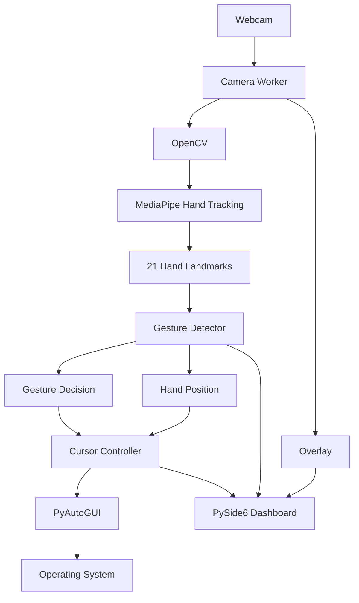

# GestureFlow

**GestureFlow** is a real-time, touchless Human-Computer Interaction (HCI) system that uses computer vision and hand gestures to control the operating-system cursor without physical mouse input.

The system captures hand movement through a webcam, extracts hand landmarks using MediaPipe, interprets finger configurations as gestures, transforms hand coordinates into screen coordinates, and generates operating-system mouse actions.

```text
Webcam
   ↓
OpenCV Frame Capture
   ↓
MediaPipe Hand Tracking
   ↓
21 Hand Landmarks
   ↓
Gesture Detection
   ↓
Coordinate Transformation
   ↓
Cursor Smoothing
   ↓
Cursor / Mouse Action
   ↓
Operating System
```

---

# Core Capabilities

GestureFlow currently supports:

* Real-time hand tracking
* 21-point MediaPipe hand landmarks
* Touchless cursor movement
* Camera-to-screen coordinate mapping
* Configurable movement boundaries
* Cursor smoothing
* Screen-edge protection
* Camera mirroring
* Left click
* Right click
* Double click
* Click-and-hold drag
* Gesture-based mouse interaction
* Modular gesture and cursor-control architecture
* PySide6-based application dashboard
* Threaded camera-processing architecture

---

# System Architecture

GestureFlow has evolved from a simple webcam-to-cursor script into a modular real-time application.



The major layers are separated by responsibility:

| Layer             | Responsibility                                    |
| ----------------- | ------------------------------------------------- |
| Camera Worker     | Captures and processes camera frames              |
| OpenCV            | Video capture and frame processing                |
| MediaPipe         | Hand detection and landmark extraction            |
| Gesture Detector  | Interprets landmark configurations as gestures    |
| Cursor Controller | Converts hand coordinates into cursor coordinates |
| PyAutoGUI         | Sends mouse interaction to the operating system   |
| Overlay           | Provides visual feedback on the camera stream     |
| PySide6           | Provides the application dashboard and UI         |

---

# High-Level Data Flow

The complete interaction can be understood as a perception-to-action pipeline:

```text
                PERCEPTION
                    │
                    ▼
              ┌───────────┐
              │  Webcam   │
              └─────┬─────┘
                    ↓
              ┌───────────┐
              │  OpenCV   │
              └─────┬─────┘
                    ↓
              ┌───────────┐
              │ MediaPipe │
              └─────┬─────┘
                    ↓
              21 Landmarks
                    │
                    ▼
               INTERPRETATION
                    │
                    ▼
          ┌────────────────────┐
          │ Gesture Detector   │
          └─────────┬──────────┘
                    │
                    ▼
             Gesture / Position
                    │
                    ▼
                CONTROL
                    │
                    ▼
          ┌────────────────────┐
          │ Cursor Controller  │
          └─────────┬──────────┘
                    │
                    ▼
             PyAutoGUI Input
                    │
                    ▼
                 OS Mouse
```

This separation allows **hand perception**, **gesture interpretation**, and **OS interaction** to evolve independently.

---

# Low-Level Processing Pipeline

For every camera frame, GestureFlow performs a sequence of operations:

```text
Camera Frame
     ↓
Frame Acquisition
     ↓
Color / Image Preprocessing
     ↓
Hand Landmark Detection
     ↓
Landmark Extraction
     ↓
Gesture Feature Analysis
     ↓
Gesture Classification
     ↓
Coordinate Mapping
     ↓
Smoothing / Filtering
     ↓
Mouse Action
```

The processing loop continuously repeats while the application is running.

---

# 1. Frame Acquisition

The webcam provides a continuous stream of image frames.

OpenCV handles the camera interface and provides the raw frame to the processing pipeline.

Conceptually:

```python
ret, frame = cap.read()
```

Each frame can be represented as:

```text
Height × Width × 3
```

where the three channels represent the image color channels.

The camera worker is responsible for continuously acquiring these frames without blocking the main dashboard interface.

---

# 2. Camera Worker and Threading

The application uses a **PySide6 `QThread`-based camera worker architecture**.

This is important because camera capture and MediaPipe processing are continuous operations.

Instead of performing the entire vision pipeline directly on the UI thread:

```text
UI Thread
   │
   ├── Camera
   ├── MediaPipe
   ├── Gesture Detection
   └── Cursor Control
```

GestureFlow separates the processing workload:

```text
┌─────────────────────┐
│   PySide6 UI Thread │
│                     │
│ Dashboard / UI      │
└──────────┬──────────┘
           │
           │ Signals
           ▼
┌─────────────────────┐
│    Camera Worker    │
│      QThread        │
│                     │
│ OpenCV              │
│ MediaPipe           │
│ Gesture Detector    │
│ Cursor Controller   │
│ Overlay             │
└─────────────────────┘
```

This architecture allows the camera-processing pipeline to run continuously while the dashboard remains responsive.

---

# 3. Image Preprocessing

OpenCV frames are prepared before being passed into the hand-tracking pipeline.

A typical transformation is:

```text
OpenCV BGR Frame
       ↓
Color Conversion
       ↓
RGB Frame
       ↓
MediaPipe
```

For example:

```python
rgb_frame = cv2.cvtColor(frame, cv2.COLOR_BGR2RGB)
```

Camera mirroring can also be applied so that hand movement behaves naturally from the user's perspective.

---

# 4. Hand Landmark Detection

MediaPipe processes the camera frame and produces a structured hand representation.

Instead of simply returning:

```text
Hand detected
```

the system obtains **21 landmarks**.

```text
Frame
  ↓
MediaPipe
  ↓
Hand
  ↓
21 Landmark Points
  ↓
(x, y, z)
```

Each landmark contains normalized positional information.

```python
landmark.x
landmark.y
landmark.z
```

The primary coordinates used for interaction are:

```text
x → horizontal position
y → vertical position
z → relative depth
```

---

# 5. The 21-Landmark Representation

The hand is represented using anatomical landmarks covering:

* Wrist
* Thumb
* Index finger
* Middle finger
* Ring finger
* Little finger

The important property for GestureFlow is that **multiple gestures can be derived from the same landmark representation**.

For example:

```text
21 Landmarks
      │
      ├── Index Tip → Cursor Position
      │
      ├── Thumb + Index → Left Click / Drag
      │
      ├── Thumb + Middle → Right Click
      │
      └── Thumb + Ring → Double Click
```

This makes the landmark layer reusable rather than creating a separate vision pipeline for every mouse action.

---

# 6. Coordinate System

MediaPipe provides normalized coordinates.

Conceptually:

```text
(0,0)
  ┌──────────────────────────→ X
  │
  │
  │       Hand
  │         ●
  │
  │
  ↓
  Y
```

The coordinates are independent of the physical camera resolution.

For example:

```text
x = 0.50
y = 0.40
```

represents a relative position within the camera frame rather than a specific pixel.

These normalized coordinates must then be transformed into screen coordinates.

---

# 7. Camera-to-Screen Coordinate Transformation

The operating system requires actual screen coordinates:

```text
(0 ... screen_width)
(0 ... screen_height)
```

GestureFlow therefore performs a coordinate transformation:

```text
MediaPipe Coordinates
        ↓
Active Camera Region
        ↓
Coordinate Clamping
        ↓
Screen Coordinate Mapping
        ↓
Screen Padding
        ↓
Cursor Position
```

The conceptual transformation is:

$$
x_s =
\frac{x-x_{min}}
{x_{max}-x_{min}}
\times W_s
$$

$$
y_s =
\frac{y-y_{min}}
{y_{max}-y_{min}}
\times H_s
$$

where:

* \(x,y\) are the detected hand coordinates
* \(x_{min},x_{max}\) define the active camera region
* \(y_{min},y_{max}\) define the active camera region
* \(W_s,H_s\) are screen dimensions
* \(x_s,y_s\) are the resulting cursor coordinates

---

# 8. Active Camera Region

GestureFlow does not rely on the entire camera frame for cursor movement.

The current cursor controller uses an active range approximately equivalent to:

```text
X: 0.10 → 0.90
Y: 0.10 → 0.90
```

Conceptually:

```text
┌─────────────────────────────────┐
│           10% Margin            │
│    ┌───────────────────────┐    │
│    │                       │    │
│ 10%│    ACTIVE CONTROL     │10% │
│    │        REGION         │    │
│    │                       │    │
│    └───────────────────────┘    │
│           10% Margin            │
└─────────────────────────────────┘
```

This prevents small movements near the camera boundary from immediately pushing the cursor to the screen edge.

The active region is then normalized to the usable screen area.

---

# 9. Coordinate Clamping

A detected landmark can move outside the intended control region.

Before mapping it to the screen, the coordinate is constrained to the valid range.

```text
Detected Landmark
       ↓
Is coordinate inside active region?
       ↓
     Clamp
       ↓
Normalized Control Position
       ↓
Screen Coordinates
```

This prevents invalid or excessively large cursor positions.

---

# 10. Screen Padding

GestureFlow also uses screen padding.

The current controller uses:

```python
screen_padding = 5
```

This keeps the generated cursor position slightly away from the extreme screen boundary.

Conceptually:

```text
┌────────────────────────────────┐
│ 5px                            │
│   ┌────────────────────────┐   │
│   │                        │   │
│   │    Cursor Region       │   │
│   │                        │   │
│   └────────────────────────┘   │
│                           5px  │
└────────────────────────────────┘
```

This provides a small safety boundary around the usable screen area.

---

# 11. Cursor Smoothing

Hand landmark detection is not perfectly stable.

Even when the hand remains relatively stationary, detected coordinates can fluctuate:

```text
Frame 1 → 500
Frame 2 → 503
Frame 3 → 498
Frame 4 → 504
Frame 5 → 501
```

Without filtering, these variations become cursor jitter.

GestureFlow therefore processes the calculated cursor position before sending it to the operating system.

```text
Raw Hand Position
       ↓
Coordinate Mapping
       ↓
Position Noise
       ↓
Smoothing
       ↓
Stable Cursor Position
```

The cursor controller exposes smoothing as a configurable parameter:

```python
CursorController(
    smoothing=1,
    margin=0.1,
    screen_padding=5,
)
```

The exact behavior of the smoothing parameter is handled inside the cursor-control layer, keeping filtering logic separate from hand detection.

---

# 12. Gesture Detection

Gesture recognition operates on the hand landmarks rather than directly on raw camera pixels.

```text
Camera Image
      ↓
Hand Landmarks
      ↓
Geometric Relationships
      ↓
Finger Configuration
      ↓
Gesture
```

This approach makes the gesture layer considerably lighter than performing classification directly on full-resolution images.

For example, the distance between two landmarks can be calculated using:

$$
d =
\sqrt{
(x_2-x_1)^2 +
(y_2-y_1)^2
}
$$

A threshold can then determine whether two fingertips are sufficiently close to represent a pinch.

---

# 13. Current Gesture Mapping

GestureFlow currently uses different finger combinations to trigger mouse actions.

| Gesture               | Action          |
| --------------------- | --------------- |
| Index finger position | Cursor movement |
| Thumb + Index         | Left click      |
| Thumb + Middle        | Right click     |
| Thumb + Ring          | Double click    |
| Held Thumb + Index    | Drag            |

This allows several mouse interactions to be performed without changing the underlying hand-tracking system.

The important architectural distinction is:

```text
Gesture Detection
       ↓
Action Decision
       ↓
Mouse Controller
```

rather than embedding mouse behavior directly into the MediaPipe detection layer.

---

# 14. Click and Drag State

Simple gestures such as clicking can be treated as discrete events.

Dragging is different because it is a **stateful interaction**.

Conceptually:

```text
Normal
  ↓
Pinch Detected
  ↓
Drag Started
  ↓
Hand Movement
  ↓
Cursor Follows Hand
  ↓
Pinch Released
  ↓
Drag Ended
```

This means the gesture system has to consider both:

* Current landmark configuration
* Previous interaction state

rather than evaluating every frame as an isolated event.

---

# 15. Complete Low-Level Pipeline

The complete internal flow is:

```text
                    ┌─────────────┐
                    │   Webcam    │
                    └──────┬──────┘
                           ↓
                    ┌─────────────┐
                    │ OpenCV      │
                    │ Frame       │
                    └──────┬──────┘
                           ↓
                    ┌─────────────┐
                    │ Preprocess  │
                    │ BGR → RGB   │
                    └──────┬──────┘
                           ↓
                    ┌─────────────┐
                    │ MediaPipe   │
                    └──────┬──────┘
                           ↓
                    ┌─────────────┐
                    │ 21          │
                    │ Landmarks   │
                    └──────┬──────┘
                           ↓
              ┌────────────┴────────────┐
              ↓                         ↓
       Hand Position              Finger Relations
              ↓                         ↓
       Cursor Mapping              Gesture Detector
              ↓                         ↓
       Smoothing / Filter        Action Decision
              └────────────┬────────────┘
                           ↓
                    ┌─────────────┐
                    │ Mouse       │
                    │ Controller  │
                    └──────┬──────┘
                           ↓
                    ┌─────────────┐
                    │ PyAutoGUI   │
                    └──────┬──────┘
                           ↓
                    Operating System
```

---

# 16. Application Architecture

The project currently follows a modular architecture:

```text
src/
│
├── main.py
│
├── hand_tracking/
│   └── hand_detector.py
│
├── gestures/
│   └── gesture_detector.py
│
└── cursor/
    └── cursor_controller.py
```

The application also incorporates the dashboard and camera-worker architecture around these core components.

### `hand_detector.py`

Responsible for:

* MediaPipe initialization
* Hand detection
* Landmark extraction
* Hand-tracking results

### `gesture_detector.py`

Responsible for:

* Landmark-based gesture analysis
* Finger relationships
* Gesture recognition
* Mouse-action decisions

### `cursor_controller.py`

Responsible for:

* Camera-to-screen mapping
* Active movement region
* Coordinate clamping
* Screen padding
* Cursor smoothing
* Cursor movement

### Camera Worker

Responsible for coordinating the continuous real-time pipeline:

```text
Camera
  ↓
OpenCV
  ↓
MediaPipe
  ↓
Gesture Detector
  ↓
Cursor Controller
  ↓
Overlay
```

### PySide6 Dashboard

Provides the application interface and communicates with the processing layer while the camera work runs independently through `QThread`.

---

# 17. Why the Architecture Is Layered

The architecture follows a **separation-of-concerns** approach.

```text
Perception
    │
    ▼
Hand Detector
    │
    ▼
Landmarks
    │
    ▼
Interpretation
    │
    ▼
Gesture Detector
    │
    ▼
Control
    │
    ▼
Cursor Controller
    │
    ▼
OS Interaction
```

This provides several advantages.

A change to MediaPipe does not require rewriting cursor mapping.

A new gesture does not require modifying the camera-capture layer.

A different cursor-control strategy does not require changing hand detection.

This makes the system easier to extend and debug.

---

# 18. Real-Time Processing Model

GestureFlow is fundamentally a continuous event-processing system.

For every frame:

```text
Frame N
  ↓
Detect
  ↓
Interpret
  ↓
Act

Frame N+1
  ↓
Detect
  ↓
Interpret
  ↓
Act

Frame N+2
  ↓
Detect
  ↓
Interpret
  ↓
Act
```

The resulting interaction is therefore determined by the combined latency of:

```text
Camera Capture
      +
Image Processing
      +
Hand Landmark Inference
      +
Gesture Processing
      +
Coordinate Processing
      +
OS Mouse Update
```

This is why real-time HCI systems require more than simply achieving accurate hand detection: the complete pipeline must also remain responsive.

---

# 19. Design Decisions

## MediaPipe for Hand Tracking

MediaPipe provides a structured 21-landmark representation that is well suited to real-time gesture processing.

Instead of training a custom hand detector, GestureFlow can operate directly on the extracted landmark geometry.

---

## OpenCV for Vision Input

OpenCV handles the low-level camera and image-processing layer.

It provides the bridge between:

```text
Physical Camera
       ↓
Digital Image Frames
       ↓
Computer Vision Pipeline
```

---

## PyAutoGUI for OS Interaction

PyAutoGUI provides the final bridge:

```text
Screen Coordinates
       ↓
PyAutoGUI
       ↓
Operating-System Mouse
```

This keeps operating-system interaction independent from the vision pipeline.

---

## PySide6 + QThread for the Dashboard

The application uses a threaded camera-worker model so that continuous frame processing does not have to run directly on the dashboard's UI thread.

This is particularly important because:

* Camera capture is continuous
* MediaPipe inference is computationally active
* Gesture processing runs repeatedly
* The UI needs to remain responsive

---

# 20. Performance

GestureFlow's performance is influenced by:

```text
Camera Resolution
        ↓
Frame Processing
        ↓
MediaPipe Inference
        ↓
Gesture Analysis
        ↓
Cursor Processing
        ↓
OS Interaction
```

Important metrics for a real-time HCI system include:

| Metric             | Meaning                                             |
| ------------------ | --------------------------------------------------- |
| FPS                | Frames processed per second                         |
| Inference Time     | Time spent in hand detection                        |
| Processing Time    | Total processing time per frame                     |
| End-to-End Latency | Delay between physical movement and cursor response |
| CPU Usage          | Computational cost of the application               |

These metrics can be profiled as the system is optimized.

---

# 21. Error and Edge-Case Handling

The pipeline needs to account for unreliable vision input.

### No Hand Detected

```text
No Hand
   ↓
No Valid Landmarks
   ↓
No Cursor Update
```

### Hand Near Boundary

```text
Landmark
   ↓
Active Region Check
   ↓
Clamp
   ↓
Safe Screen Coordinate
```

### Landmark Noise

```text
Noisy Detection
      ↓
Coordinate Variation
      ↓
Smoothing
      ↓
More Stable Cursor
```

### Stateful Gesture

```text
Gesture Start
      ↓
Maintain State
      ↓
Perform Action
      ↓
Gesture Release
      ↓
Reset State
```

This is particularly relevant to drag operations, where the system must maintain an interaction state across multiple frames.

---

# 22. Project Structure

```text
GestureFlow/
│
├── src/
│   ├── main.py
│   │
│   ├── hand_tracking/
│   │   └── hand_detector.py
│   │
│   ├── gestures/
│   │   └── gesture_detector.py
│   │
│   └── cursor/
│       └── cursor_controller.py
│
├── tests/
│
├── requirements.txt
├── README.md
└── .gitignore
```

The architecture is intentionally modular so that individual subsystems can be developed and tested independently.

---

# 23. Technology Stack

| Technology  | Role                                |
| ----------- | ----------------------------------- |
| Python 3.11 | Core application                    |
| OpenCV      | Camera capture and image processing |
| MediaPipe   | Hand landmark detection             |
| NumPy       | Numerical operations                |
| PyAutoGUI   | OS-level mouse control              |
| PySide6     | Application dashboard and UI        |

---

# 24. Installation

### Clone

```bash
git clone https://github.com/<your-username>/GestureFlow.git
cd GestureFlow
```

### Create the environment

```powershell
py -3.11 -m venv venv
```

### Activate

```powershell
.\venv\Scripts\Activate.ps1
```

### Install dependencies

```powershell
pip install -r requirements.txt
```

---

# 25. Running

```powershell
python src/main.py
```

The application initializes the camera, hand-tracking pipeline, gesture detection, cursor control, and dashboard.

Press:

```text
q
```

to exit the camera-processing loop where applicable.

---

# 26. Requirements

### Hardware

* Webcam
* Modern CPU
* 4 GB+ RAM recommended
* Adequate lighting

### Software

* Python 3.11
* Webcam access
* Supported desktop operating system

A dedicated GPU is not required for the core pipeline.

---

# 27. Limitations

Vision-based interaction is inherently affected by the quality of the input.

Factors that can influence performance include:

* Poor lighting
* Motion blur
* Hand occlusion
* Background clutter
* Webcam quality
* Extreme hand angles
* Landmark detection noise
* Rapid hand movement

The system also depends on maintaining a sufficiently visible hand for reliable landmark detection.

---

# 28. Future Direction

The current architecture provides a foundation for expanding GestureFlow beyond basic mouse interaction.

The existing separation between landmarks, gestures, and actions makes it possible to introduce additional interaction layers such as:

```text
Hand Landmarks
       ↓
Gesture Engine
       ↓
Action Dispatcher
       ├── Mouse
       ├── Scroll
       ├── Drag
       ├── Keyboard
       ├── Application Controls
       └── Custom Shortcuts
```

Potential extensions include:

* User-defined gesture mappings
* Gesture confidence thresholds
* Automatic calibration
* Adaptive cursor smoothing
* Multi-hand interaction
* Application-specific gesture profiles
* Additional system controls

---

# 29. Privacy

GestureFlow is designed around local processing.

```text
Webcam
   ↓
Local Machine
   ↓
OpenCV
   ↓
MediaPipe
   ↓
Local Gesture Processing
   ↓
Local Cursor Control
```

The core interaction pipeline does not require camera frames to be uploaded to a remote server.

---

# Technical Summary

GestureFlow is essentially a **real-time perception → interpretation → control system**.

The physical movement of a hand is transformed into operating-system input through several computational layers:

```text
Physical Hand
     ↓
Camera Sensor
     ↓
Image Matrix
     ↓
Computer Vision
     ↓
21 Landmark Representation
     ↓
Geometric Feature Extraction
     ↓
Gesture / Position Interpretation
     ↓
Coordinate Transformation
     ↓
Temporal Smoothing
     ↓
Mouse Event
     ↓
Operating System
```

The key engineering idea is that GestureFlow does not treat the webcam, gesture recognition, and cursor control as one monolithic operation.

Instead, it separates:

```text
PERCEPTION
    Hand Detection
        ↓
INTERPRETATION
    Gesture Detection
        ↓
CONTROL
    Cursor / Mouse Actions
        ↓
INTERFACE
    Operating System
```

This architecture provides a foundation for building a broader touchless HCI framework rather than a single-purpose cursor-control script.

---

## Built With

**Python · OpenCV · MediaPipe · NumPy · PyAutoGUI · PySide6**

---

## Author

**Dhruv Lad**

GestureFlow — Touchless Human-Computer Interaction using Computer Vision
