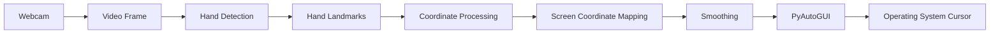
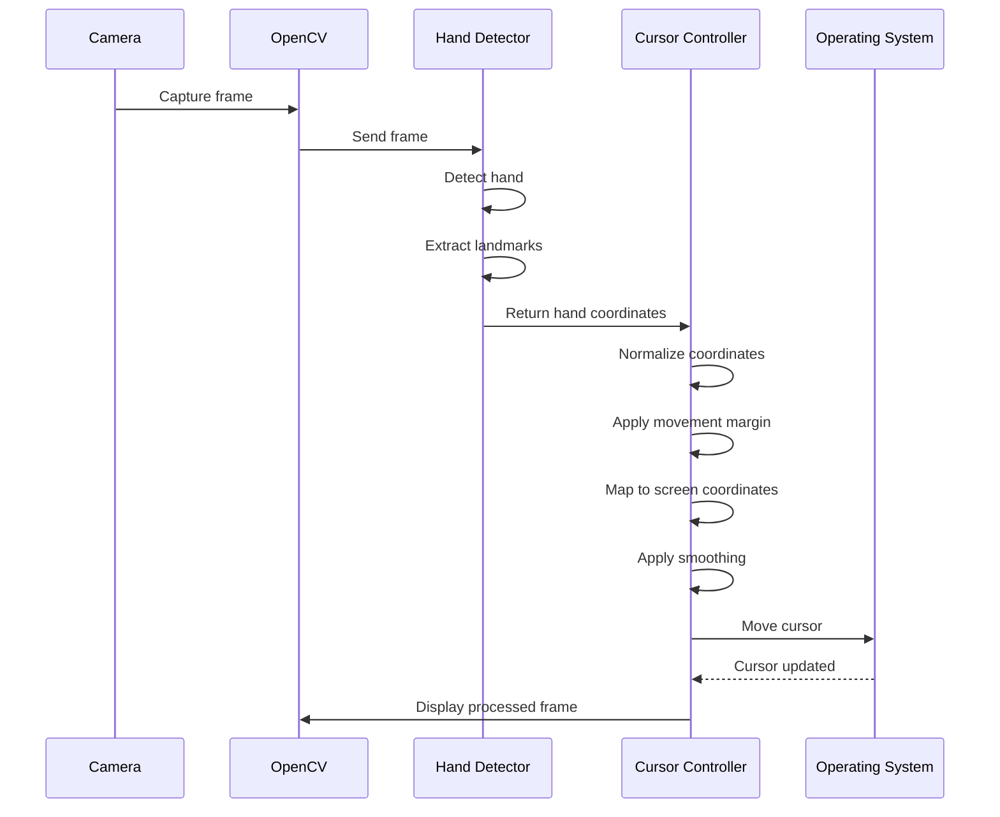
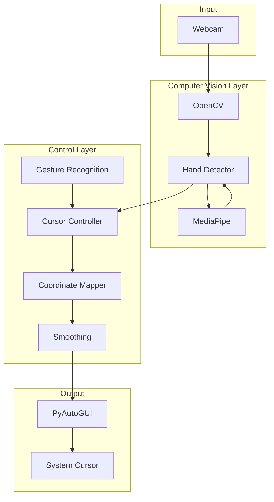
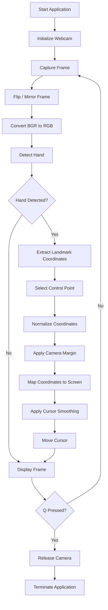
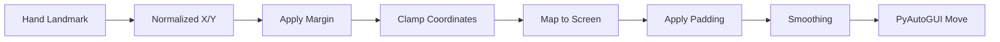
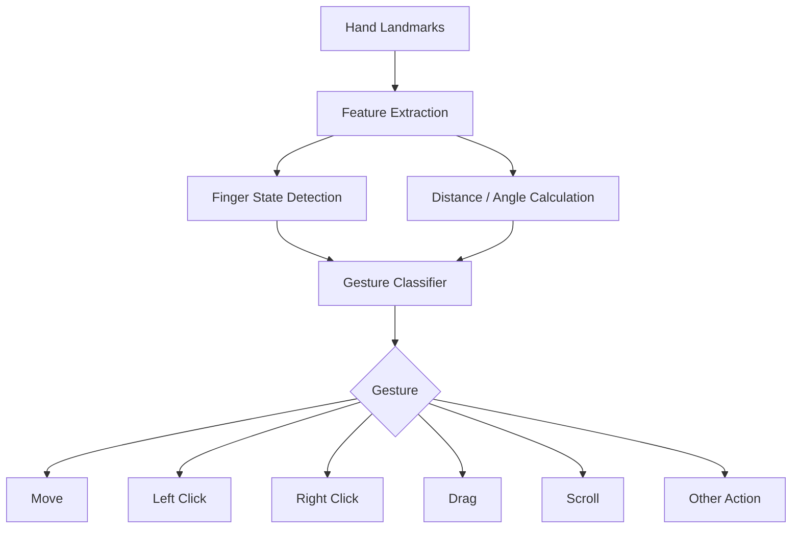
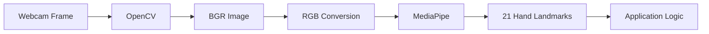
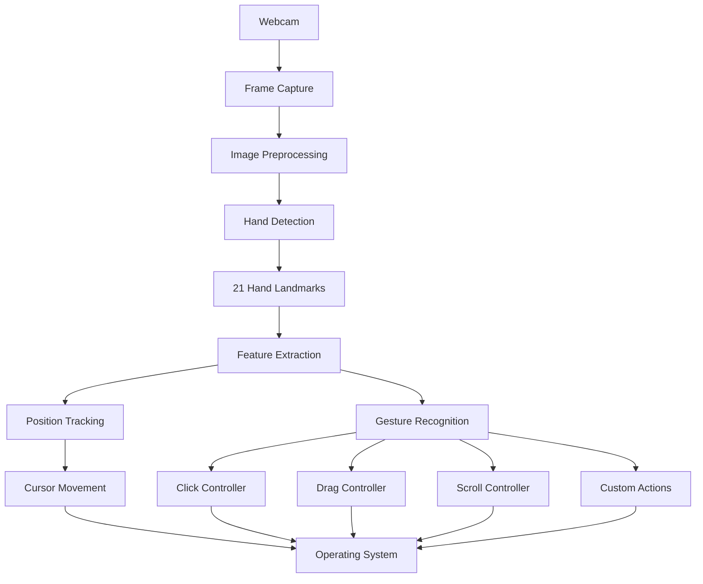
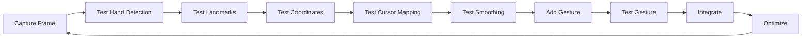

# GestureFlow

GestureFlow is a Python-based touchless human-computer interaction system that allows users to control the operating-system cursor using real-time hand movements captured through a webcam.

The project uses computer vision and hand-landmark detection to translate hand coordinates into screen coordinates. It also provides a foundation for adding gesture-based interactions such as clicking, dragging, scrolling, and other touchless controls.

The primary objective of GestureFlow is to create a natural, contactless interface between the user and a computer using only a standard webcam.

---

## Table of Contents

* [Overview](#overview)
* [Problem Statement](#problem-statement)
* [Objectives](#objectives)
* [Key Features](#key-features)
* [How It Works](#how-it-works)
* [System Architecture](#system-architecture)
* [Processing Pipeline](#processing-pipeline)
* [Coordinate Mapping](#coordinate-mapping)
* [Cursor Smoothing](#cursor-smoothing)
* [Project Structure](#project-structure)
* [Technology Stack](#technology-stack)
* [Requirements](#requirements)
* [Installation](#installation)
* [Running the Project](#running-the-project)
* [Controls](#controls)
* [Configuration](#configuration)
* [Core Components](#core-components)
* [Hand Tracking](#hand-tracking)
* [Cursor Controller](#cursor-controller)
* [Gesture Recognition](#gesture-recognition)
* [Camera Mirroring](#camera-mirroring)
* [Error Handling and Troubleshooting](#error-handling-and-troubleshooting)
* [Performance Considerations](#performance-considerations)
* [Security and Privacy](#security-and-privacy)
* [Future Enhancements](#future-enhancements)
* [Use Cases](#use-cases)
* [Limitations](#limitations)
* [Learning Outcomes](#learning-outcomes)
* [Project Development Roadmap](#project-development-roadmap)
* [Contributing](#contributing)
* [License](#license)

---

# Overview

Traditional computer interaction primarily depends on physical input devices such as a mouse, keyboard, touchscreen, or trackpad.

GestureFlow explores an alternative interaction method:

> Move your hand in front of a webcam and use the detected hand position to control the system cursor.

The webcam continuously captures frames. Computer vision algorithms detect the user's hand and identify important landmarks such as the fingertips and joints. The detected coordinates are then transformed from camera coordinates into screen coordinates.

The resulting coordinates are sent to the operating system through PyAutoGUI.

### High-Level Concept



---

# Problem Statement

Computer interaction generally requires physical contact with an input device.

GestureFlow addresses the following problem:

**How can a standard webcam be used to create a real-time, touchless cursor-control system without requiring specialized hardware?**

The system should:

1. Capture the user's hand using a webcam.
2. Detect the hand in real time.
3. Extract hand landmarks.
4. Determine a suitable point for cursor control.
5. Convert camera coordinates to screen coordinates.
6. Move the operating-system cursor.
7. Reduce unwanted cursor jitter.
8. Provide a foundation for gesture-based mouse operations.

---

# Objectives

The main objectives of GestureFlow are:

* Build a real-time computer-vision-based cursor controller.
* Use a standard webcam instead of specialized hardware.
* Detect hand landmarks using MediaPipe.
* Translate hand movement into cursor movement.
* Provide configurable cursor responsiveness.
* Reduce jitter through coordinate smoothing.
* Provide a modular Python architecture.
* Create a foundation for additional touchless gestures.
* Keep the system lightweight enough for real-time operation.

---

# Key Features

| Feature                     | Description                                                              |
| --------------------------- | ------------------------------------------------------------------------ |
| Real-Time Hand Tracking     | Detects hands continuously from webcam frames                            |
| Hand Landmark Detection     | Extracts detailed hand landmark coordinates                              |
| Cursor Control              | Uses hand movement to control the system cursor                          |
| Coordinate Mapping          | Converts camera coordinates into screen coordinates                      |
| Movement Area               | Allows exclusion of unstable camera-frame edges                          |
| Cursor Smoothing            | Reduces unwanted cursor jitter                                           |
| Configurable Responsiveness | Cursor sensitivity can be adjusted                                       |
| Camera Mirroring            | Provides natural mirror-like hand interaction                            |
| Modular Architecture        | Separates tracking and cursor-control responsibilities                   |
| Cross-Platform Python Logic | Uses Python-based computer vision and automation libraries               |
| Extensible Gesture System   | Architecture can be extended with click, drag, scroll and other gestures |
| Keyboard Exit               | Allows the application to be terminated using `q`                        |

---

# How It Works

GestureFlow follows a continuous processing loop.



The loop repeats for every camera frame.

---

# System Architecture

GestureFlow follows a modular architecture where each major responsibility is separated into its own component.



---

# Processing Pipeline

The complete pipeline can be represented as:



---

# Coordinate Mapping

One of the most important parts of GestureFlow is converting the position of the hand from the webcam coordinate system into the computer's screen coordinate system.

A webcam frame might have dimensions such as:

```text
Camera:
Width  = 1280
Height = 720
```

while the monitor might have:

```text
Screen:
Width  = 1920
Height = 1080
```

Therefore, camera coordinates cannot simply be used directly as cursor coordinates.

## Camera Coordinate System

The camera provides coordinates approximately in the following range:

```text
x = 0       ----------------------> camera width
y = 0
|
|
|
v
camera height
```

MediaPipe landmarks use normalized coordinates:

```text
x ∈ [0, 1]
y ∈ [0, 1]
```

where:

* `0, 0` represents the top-left.
* `1, 1` represents the bottom-right.

---

# Movement Margin

The entire camera frame is not necessarily ideal for cursor control.

The outer edges can produce uncomfortable or unstable cursor movement.

GestureFlow therefore supports a configurable `margin`.

For example:

```text
             Camera Frame

        +-----------------------+
        |       margin          |
        |   +---------------+   |
        |   |               |   |
        | m |   CONTROL     | m |
        |   |    AREA       |   |
        |   |               |   |
        |   +---------------+   |
        |       margin          |
        +-----------------------+
```

The usable region is mapped to the entire screen.

This means a relatively small hand movement inside the active camera region can cover the full screen.

---

# Coordinate Transformation

If:

```text
x = detected hand x-coordinate
y = detected hand y-coordinate

margin = excluded percentage
```

the effective movement region is approximately:

```text
x ∈ [margin, 1 - margin]
y ∈ [margin, 1 - margin]
```

The coordinate is then clamped to the active region and mapped to screen coordinates.

Conceptually:

```text
Camera Coordinate
        |
        v
Normalize
        |
        v
Clamp to Movement Area
        |
        v
Scale to Screen Resolution
        |
        v
Screen Coordinate
```

This allows the system to work independently of the webcam and monitor resolutions.

---

# Cursor Smoothing

Raw hand tracking can produce small variations between frames.

For example:

```text
Frame 1: x = 0.501
Frame 2: x = 0.497
Frame 3: x = 0.504
Frame 4: x = 0.499
```

Even though the user's hand may appear stationary, these small variations can cause cursor jitter.

GestureFlow therefore provides cursor smoothing.

A simple smoothing model can be represented as:

```text
smoothed_position =
    previous_position × (1 - smoothing_factor)
    + current_position × smoothing_factor
```

A higher responsiveness value causes the cursor to follow the hand more directly.

A lower responsiveness value produces smoother but potentially slower cursor movement.

---

# Project Structure

The project is organized to separate computer vision, hand tracking, cursor control, and application logic.

```text
GestureFlow/
│
├── src/
│   │
│   ├── hand_tracking/
│   │   ├── __init__.py
│   │   └── hand_detector.py
│   │
│   ├── cursor_control/
│   │   ├── __init__.py
│   │   └── cursor_controller.py
│   │
│   └── main.py
│
├── tests/
│   └── ...
│
├── requirements.txt
├── README.md
└── .gitignore
```

The exact structure can evolve as additional gesture modules are implemented.

---

# Technology Stack

| Technology  | Purpose                                        |
| ----------- | ---------------------------------------------- |
| Python 3.11 | Main programming language                      |
| OpenCV      | Webcam access and image processing             |
| MediaPipe   | Hand detection and landmark tracking           |
| PyAutoGUI   | Operating-system mouse control                 |
| NumPy       | Numerical operations and coordinate processing |
| Git         | Version control                                |
| GitHub      | Source-code hosting                            |

---

# Requirements

## Hardware

Minimum recommended hardware:

| Component | Requirement                                    |
| --------- | ---------------------------------------------- |
| Webcam    | Any webcam capable of continuous video capture |
| Processor | Modern dual-core or better                     |
| RAM       | 4 GB minimum                                   |
| Display   | Standard monitor                               |
| Lighting  | Reasonably well-lit environment                |

A dedicated GPU is not required for the basic system.

---

# Software Requirements

The project currently uses Python 3.11.

The development environment has been tested with:

```text
Python 3.11.x
OpenCV
MediaPipe
PyAutoGUI
NumPy
```

Using a virtual environment is recommended.

---

# Installation

## 1. Clone the Repository

```bash
git clone https://github.com/<your-username>/GestureFlow.git
cd GestureFlow
```

Replace `<your-username>` with the GitHub account containing the repository.

---

## 2. Create a Virtual Environment

On Windows:

```powershell
py -3.11 -m venv venv
```

---

## 3. Activate the Virtual Environment

PowerShell:

```powershell
.\venv\Scripts\Activate.ps1
```

If activation is successful, the terminal should show:

```text
(venv)
```

before the current directory.

---

## 4. Install Dependencies

```powershell
pip install -r requirements.txt
```

If a requirements file has not yet been created:

```powershell
pip install opencv-python mediapipe pyautogui numpy
```

---

# Running the Project

Activate the virtual environment first:

```powershell
.\venv\Scripts\Activate.ps1
```

Then run the main application:

```powershell
python src/main.py
```

The application should initialize the webcam and begin detecting the user's hand.

The terminal should display a startup message similar to:

```text
GestureFlow started. Press 'q' to quit.
```

---

# Controls

| Input         | Action                   |
| ------------- | ------------------------ |
| Hand movement | Controls cursor position |
| `q`           | Exit the application     |

Additional controls can be introduced as gesture recognition is expanded.

---

# Configuration

The cursor controller exposes configurable parameters.

Example:

```python
CursorController(
    smoothing=1,
    margin=0.1,
    screen_padding=5,
)
```

## Parameters

| Parameter        | Purpose                                                                           |
| ---------------- | --------------------------------------------------------------------------------- |
| `smoothing`      | Controls how closely the cursor follows the detected hand                         |
| `margin`         | Defines the percentage of the camera frame excluded from cursor movement          |
| `screen_padding` | Prevents the cursor from being positioned directly at the extreme screen boundary |

---

## Smoothing

Example:

```python
smoothing=1
```

A value of `1` provides maximum responsiveness with minimal smoothing.

Lower values can be used when more stability is desired.

Conceptually:

```text
Higher smoothing / responsiveness
        |
        +---- Faster cursor response
        +---- Less lag
        +---- Potentially more jitter

Lower smoothing / responsiveness
        |
        +---- More stable movement
        +---- More filtering
        +---- Potentially more cursor lag
```

---

## Margin

Example:

```python
margin=0.1
```

means approximately 10% of the camera frame is excluded around the movement area.

This creates a more comfortable control region.

---

## Screen Padding

Example:

```python
screen_padding=5
```

This prevents the cursor from being positioned exactly at the extreme screen boundary.

---

# Core Components

GestureFlow is divided into several logical components.

## 1. Camera Module

Responsible for:

* Opening the webcam.
* Reading frames.
* Handling frame capture.
* Providing frames to the computer-vision pipeline.
* Releasing the camera when the application exits.

---

## 2. Hand Detector

The hand detector is responsible for:

* Receiving camera frames.
* Processing the image.
* Detecting hands.
* Extracting hand landmarks.
* Returning landmark coordinates.

MediaPipe provides a standardized representation of the hand.

A detected hand contains landmarks representing points such as:

```text
                 8
                 |
                 |
            7 ---6
                 |
                 |
     4           5
     |           |
     3           |
     |           |
     2           |
     |           |
     1-----------0
```

The complete MediaPipe hand model contains 21 landmarks.

---

# Hand Landmark Model

MediaPipe identifies 21 hand landmarks.

The major landmark groups are:

| Finger / Region | Landmarks |
| --------------- | --------- |
| Wrist           | 0         |
| Thumb           | 1–4       |
| Index Finger    | 5–8       |
| Middle Finger   | 9–12      |
| Ring Finger     | 13–16     |
| Little Finger   | 17–20     |

For cursor movement, a fingertip or another stable landmark can be selected as the control point.

For example:

```text
Index fingertip
      |
      v
Landmark 8
      |
      v
Normalized coordinates
      |
      v
Screen coordinates
      |
      v
Cursor position
```

---

# Cursor Controller

The `CursorController` is responsible for translating detected hand coordinates into operating-system cursor movement.

Its responsibilities include:

1. Receiving the selected landmark.
2. Normalizing the coordinates.
3. Applying the configured movement margin.
4. Mapping coordinates to screen dimensions.
5. Applying screen padding.
6. Applying smoothing.
7. Sending the resulting position to PyAutoGUI.

Conceptual flow:



---

# Gesture Recognition

Gesture recognition is the natural next layer above hand tracking.

Instead of using only the hand position, GestureFlow can analyze the relative positions of multiple landmarks.

For example:

```text
Index finger extended
Middle finger folded
Ring finger folded
Little finger folded
```

can represent one gesture.

Possible gesture mappings include:

| Gesture                       | Possible Action                  |
| ----------------------------- | -------------------------------- |
| Index finger movement         | Cursor movement                  |
| Index + thumb pinch           | Left click                       |
| Two-finger gesture            | Right click                      |
| Pinch and hold                | Drag                             |
| Two fingers moving vertically | Scroll                           |
| Open palm                     | Pause/disable cursor             |
| Closed fist                   | Interaction mode toggle          |
| Swipe                         | Navigation / application control |

These gestures can be implemented as additional modules without changing the fundamental hand-tracking pipeline.

---

# Gesture Recognition Architecture

A scalable gesture system can follow this structure:



---

# Camera Mirroring

A webcam normally produces an image that may not behave like a mirror.

For a natural touchless interface, the camera frame can be horizontally flipped.

Conceptually:

```text
Without Mirroring

User moves hand left
        |
        v
Screen interaction appears reversed


With Mirroring

User moves hand left
        |
        v
Cursor moves left
```

This creates a more intuitive interaction model.

OpenCV can perform the horizontal flip using:

```python
frame = cv2.flip(frame, 1)
```

---

# Computer Vision Pipeline

OpenCV and MediaPipe operate together in the following manner:



OpenCV handles image acquisition and display while MediaPipe performs the hand-landmark detection.

---

# Real-Time Processing

GestureFlow operates on a frame-by-frame basis.

For every frame:

```text
Capture
  ↓
Preprocess
  ↓
Detect
  ↓
Extract
  ↓
Transform
  ↓
Control
  ↓
Display
  ↓
Repeat
```

The system therefore does not require a pre-recorded video or image.

---

# Error Handling and Troubleshooting

## MediaPipe `solutions` Attribute Error

An error such as:

```text
AttributeError:
module 'mediapipe' has no attribute 'solutions'
```

can indicate an installation or package-resolution issue.

Verify the installed version:

```powershell
python -c "import mediapipe as mp; print(mp.__version__)"
```

Also verify that the expected API exists:

```powershell
python -c "import mediapipe as mp; print(hasattr(mp, 'solutions'))"
```

The expected result for the project environment is:

```text
True
```

---

## `Input timestamp must be monotonically increasing`

MediaPipe may report:

```text
ValueError:
Input timestamp must be monotonically increasing.
```

This occurs when frames supplied to a MediaPipe processing pipeline do not have timestamps that increase correctly.

For a real-time webcam application, frames should be processed in chronological order.

If this error appears, check:

* Frame-processing order.
* Timestamp generation.
* Reuse of timestamps.
* Multiple processing pipelines receiving inconsistent timestamps.
* Whether the detector is being initialized repeatedly inside the frame loop.

The detector should generally be initialized once and reused.

---

## `NORM_RECT without IMAGE_DIMENSIONS` Warning

A warning such as:

```text
Using NORM_RECT without IMAGE_DIMENSIONS is only supported
for the square ROI.
Provide IMAGE_DIMENSIONS or use PROJECTION_MATRIX.
```

is generated by MediaPipe's internal processing graph.

It is generally a warning rather than a Python exception.

It indicates that a normalized rectangular region is being processed without explicit image dimensions.

If the application continues to operate correctly, the warning does not necessarily indicate a functional failure.

---

## Webcam Not Opening

If the webcam does not initialize:

1. Check whether another application is using the camera.
2. Verify Windows camera permissions.
3. Try another camera index.

For example:

```python
cap = cv2.VideoCapture(0)
```

can be changed to:

```python
cap = cv2.VideoCapture(1)
```

if another camera is available.

---

## Cursor Is Too Jittery

Possible solutions:

* Reduce cursor responsiveness.
* Increase smoothing.
* Improve lighting.
* Keep the hand within the camera's field of view.
* Avoid excessive background movement.
* Adjust the movement margin.

---

## Cursor Is Too Slow

Possible solutions:

* Increase responsiveness.
* Reduce smoothing.
* Increase the usable movement region.
* Reduce unnecessary coordinate filtering.

---

## Hand Is Not Detected Reliably

Possible causes:

* Poor lighting.
* Hand partially outside the camera frame.
* Excessive motion blur.
* Background clutter.
* Hand too far from the camera.
* Hand orientation difficult for the detector.

Recommended setup:

```text
             Webcam
               |
               v

          +---------+
          |         |
          |  Hand   |
          |         |
          +---------+

     Good lighting
     Clear background
     Stable distance
```

---

# Performance Considerations

Real-time computer vision requires processing every camera frame quickly enough to maintain responsive interaction.

The approximate relationship is:

```text
Higher FPS
   ↓
More frequent tracking updates
   ↓
More responsive cursor

Lower FPS
   ↓
Fewer updates
   ↓
Potentially noticeable cursor latency
```

Performance depends on:

* CPU performance.
* Camera resolution.
* Camera frame rate.
* MediaPipe processing complexity.
* Number of hands being tracked.
* Additional gesture calculations.
* Background applications.

A balance between resolution and processing speed should be maintained.

---

# Recommended Camera Configuration

For a typical webcam:

```text
Resolution: 640 × 480
FPS:        30
```

can provide a reasonable starting point for real-time processing.

Higher resolutions may improve landmark precision in some situations but increase processing requirements.

---

# Security and Privacy

GestureFlow processes webcam input locally as part of the application.

The webcam is used to detect hand movement and landmarks for interaction.

The project does not require uploading camera frames to a remote server for the core cursor-control functionality.

Because webcam applications process potentially sensitive visual information, users should:

* Run the application only from trusted source code.
* Verify camera permissions.
* Avoid running unknown modified versions of the application.
* Close the application when it is not needed.

---

# Use Cases

GestureFlow can be used for:

### Touchless Computer Interaction

Control the mouse without physically touching a mouse.

### Presentation Control

Use gestures to navigate presentation slides.

### Accessibility

Provide an alternative interaction method for users who cannot comfortably operate a conventional mouse.

### Smart Displays

Control screens or kiosks without physical contact.

### Media Control

Use gestures for play, pause, volume, and navigation.

### Human-Computer Interaction Research

Serve as a platform for experimenting with gesture-based interfaces.

### Computer Vision Learning

Demonstrate how computer vision can be connected to operating-system automation.

---

# Limitations

The current approach has several limitations.

## Lighting Dependency

Hand detection can become less reliable in poor lighting.

## Occlusion

If parts of the hand are hidden, landmark detection may become less accurate.

## Background Interference

Complex backgrounds can make visual tracking more difficult.

## Cursor Precision

Human hand movement naturally contains small variations, making precise pixel-level cursor control difficult without filtering.

## Camera Dependency

The quality and frame rate of the webcam affect the overall experience.

## Fatigue

Holding a hand in front of a camera for extended periods may be less comfortable than using a physical mouse.

## Gesture Ambiguity

Some gestures can produce similar landmark configurations and require carefully designed classification rules.

---

# Future Enhancements

GestureFlow can be extended considerably beyond basic cursor movement.

## 1. Click Detection

Implement pinch-based clicking.

```text
Thumb tip
    \
     \  small distance
      \
    Index tip

       ↓

   LEFT CLICK
```

---

## 2. Right Click

Use a different finger configuration to trigger a right click.

---

## 3. Drag and Drop

Use a pinch-and-hold gesture:

```text
Pinch
  ↓
Mouse Down
  ↓
Move Hand
  ↓
Mouse Movement
  ↓
Release Pinch
  ↓
Mouse Up
```

---

## 4. Scrolling

Use two fingers or a dedicated gesture to control vertical scrolling.

```text
Hand moves up
      ↓
Scroll up

Hand moves down
      ↓
Scroll down
```

---

## 5. Gesture-Based Application Control

Add gestures for:

* Play / pause.
* Volume control.
* Window switching.
* Application launching.
* Browser navigation.
* Presentation navigation.

---

## 6. Gesture Customization

Allow users to configure gestures and actions.

Example:

```text
Gesture                 Action
--------------------------------------
Pinch                   Left Click
Two Finger Pinch        Right Click
Pinch + Hold            Drag
Two Finger Up           Scroll Up
Two Finger Down         Scroll Down
Open Palm               Pause Tracking
```

---

## 7. Multi-Hand Interaction

Support simultaneous tracking of both hands.

Potential applications include:

```text
Left Hand  → Navigation
Right Hand → Cursor
```

---

## 8. Calibration System

Add an initial calibration process to automatically determine:

* Camera movement range.
* User's preferred hand position.
* Screen boundaries.
* Cursor sensitivity.
* Smoothing level.

---

## 9. Adaptive Smoothing

Instead of using a fixed smoothing value:

```text
Slow movement
    ↓
More smoothing

Fast movement
    ↓
Less smoothing
```

This could make the cursor both stable and responsive.

---

## 10. Gesture Confidence

Gesture recognition can include confidence thresholds to reduce accidental actions.

```text
Detected Gesture
       |
       v
Confidence Score
       |
       +---- Low ----> Ignore
       |
       +---- High ---> Execute
```

---

# Extended Architecture

With additional gesture functionality, the project can evolve into:



---

# Development Roadmap

| Phase    | Feature                  | Status      |
| -------- | ------------------------ | ----------- |
| Phase 1  | Python environment setup | Completed   |
| Phase 2  | Webcam integration       | Completed   |
| Phase 3  | MediaPipe hand detection | Completed   |
| Phase 4  | Hand landmark extraction | Completed   |
| Phase 5  | Cursor movement          | Completed   |
| Phase 6  | Coordinate mapping       | Completed   |
| Phase 7  | Cursor smoothing         | Implemented |
| Phase 8  | Camera mirroring         | Implemented |
| Phase 9  | Click gestures           | Planned     |
| Phase 10 | Right-click gesture      | Planned     |
| Phase 11 | Drag-and-drop            | Planned     |
| Phase 12 | Scroll gestures          | Planned     |
| Phase 13 | Gesture customization    | Planned     |
| Phase 14 | Calibration              | Planned     |
| Phase 15 | Multi-hand interaction   | Planned     |
| Phase 16 | Adaptive gesture system  | Planned     |

---

# Development Workflow

The recommended development workflow is:



Each layer can be tested independently before adding the next layer.

---

# Design Principles

GestureFlow follows several software-design principles.

## Modularity

Hand detection and cursor control are kept separate.

This allows the hand detector to be reused for future applications.

## Configurability

Important behavior such as smoothing and movement margins should not be hard-coded unnecessarily.

## Real-Time Processing

The system is designed around continuous frame processing rather than batch processing.

## Extensibility

The cursor-control system acts as the foundation for future gesture-based controls.

## Separation of Concerns

Different components handle different responsibilities:

```text
Camera
  ↓
Image Processing
  ↓
Hand Detection
  ↓
Coordinate Processing
  ↓
Gesture / Cursor Logic
  ↓
OS Interaction
```

---

# Learning Outcomes

This project provides practical experience with:

* Python application development.
* Virtual environments.
* OpenCV.
* Computer vision.
* MediaPipe.
* Hand landmark detection.
* Coordinate transformations.
* Real-time video processing.
* Human-computer interaction.
* Operating-system automation.
* Gesture recognition.
* Object-oriented programming.
* Modular software architecture.
* Real-time performance optimization.

---

# Example Interaction

A typical session looks like:

```text
1. User starts GestureFlow
          |
          v
2. Webcam initializes
          |
          v
3. Camera captures frames
          |
          v
4. MediaPipe detects hand
          |
          v
5. Index fingertip is tracked
          |
          v
6. Hand coordinates are normalized
          |
          v
7. Coordinates are mapped to display
          |
          v
8. Smoothing is applied
          |
          v
9. PyAutoGUI moves system cursor
          |
          v
10. Process repeats in real time
```

---

# Technical Summary

| Layer            | Technology / Component | Responsibility                           |
| ---------------- | ---------------------- | ---------------------------------------- |
| Input            | Webcam                 | Captures user video                      |
| Image Processing | OpenCV                 | Frame capture, preprocessing and display |
| Detection        | MediaPipe              | Detects hand and landmarks               |
| Data Processing  | Python / NumPy         | Coordinates and numerical processing     |
| Control          | Cursor Controller      | Converts landmarks into cursor movement  |
| Automation       | PyAutoGUI              | Sends cursor commands to OS              |
| Interface        | OpenCV Window          | Displays camera/tracking output          |

---

# Why GestureFlow?

GestureFlow demonstrates how a conventional webcam can be transformed into an interactive input device using software.

Instead of:

```text
Physical Hand
     ↓
Physical Mouse
     ↓
Computer
```

GestureFlow creates:

```text
Physical Hand
     ↓
Webcam
     ↓
Computer Vision
     ↓
Hand Landmarks
     ↓
Coordinate Mapping
     ↓
Gesture / Cursor Controller
     ↓
Operating System
```

The project therefore combines **computer vision, real-time processing, human-computer interaction, and system automation** into a single application.

---

# Contributing

Contributions can focus on improving:

* Hand-tracking reliability.
* Cursor precision.
* Smoothing algorithms.
* Gesture recognition.
* Performance.
* Calibration.
* User interface.
* Documentation.
* Cross-platform compatibility.

A typical contribution workflow is:

```bash
git checkout -b feature/new-gesture
```

Implement and test the feature, then commit the changes:

```bash
git add .
git commit -m "Add new gesture"
git push origin feature/new-gesture
```

Create a pull request after testing the implementation.

---

# License

Add the project's chosen license here.

For example:

```text
MIT License
```

If a license has not yet been selected, this section should be updated before publishing the repository.

---

# Project Status

GestureFlow currently provides the core foundation for touchless cursor control:

```text
Webcam
   ↓
Hand Detection
   ↓
Landmark Tracking
   ↓
Coordinate Mapping
   ↓
Cursor Smoothing
   ↓
System Cursor Control
```

The architecture is designed to support additional gesture-based interactions such as clicking, dragging, scrolling, and customizable touchless commands.

---

## Built With

* Python
* OpenCV
* MediaPipe
* NumPy
* PyAutoGUI

---

## Author

**Dhruv Lad**

GestureFlow — Touchless Human-Computer Interaction using Computer Vision
