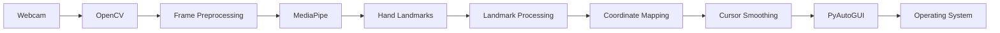
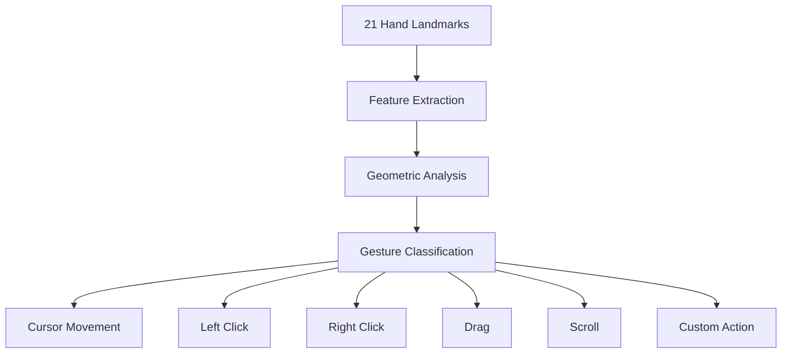
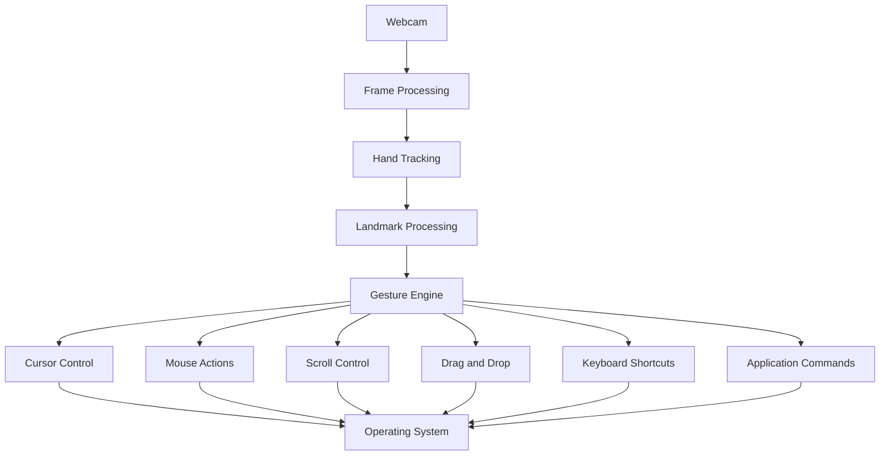

# GestureFlow

**GestureFlow** is a Python-based touchless Human-Computer Interaction (HCI) system that uses a webcam and real-time hand tracking to control the operating-system cursor.

Instead of using a physical mouse, the system interprets hand position captured through a camera and converts it into screen coordinates.

The core processing pipeline is:

```text
Webcam
   ↓
Frame Acquisition
   ↓
Image Preprocessing
   ↓
Hand Detection
   ↓
21 Hand Landmarks
   ↓
Landmark Processing
   ↓
Coordinate Transformation
   ↓
Cursor Smoothing
   ↓
PyAutoGUI
   ↓
Operating-System Cursor
```

---

## Features

* Real-time webcam-based hand tracking
* Touchless cursor control
* 21-point hand landmark detection
* Normalized camera-to-screen coordinate transformation
* Configurable movement margin
* Cursor smoothing
* Screen boundary protection
* Camera mirroring
* Modular hand-tracking and cursor-control architecture
* Foundation for gesture-based interaction

Planned interaction includes clicking, dragging, scrolling, and custom gesture actions.

---

# System Architecture

At a high level, GestureFlow is divided into independent processing stages.



Each component has a specific responsibility:

| Component          | Responsibility                                    |
| ------------------ | ------------------------------------------------- |
| Webcam             | Captures real-time video                          |
| OpenCV             | Frame acquisition and image processing            |
| MediaPipe          | Hand detection and landmark extraction            |
| Landmark Processor | Selects and processes relevant landmarks          |
| Coordinate Mapping | Converts camera coordinates to screen coordinates |
| Smoothing          | Reduces cursor jitter                             |
| PyAutoGUI          | Sends cursor movement to the operating system     |
| Application Layer  | Coordinates the complete processing loop          |

This separation allows new gestures and interaction methods to be added without rewriting the entire system.

---

# How GestureFlow Works

## 1. Frame Acquisition

The application continuously captures frames from the webcam using OpenCV.

Conceptually:

```python
ret, frame = cap.read()
```

Each frame is represented as an image matrix:

```text
Height × Width × 3
```

where the three channels represent the image color channels.

The application processes these frames continuously inside a real-time loop.

```text
Webcam
   ↓
OpenCV VideoCapture
   ↓
Raw Image Frame
   ↓
Processing Pipeline
```

---

# 2. Image Preprocessing

Before hand detection, the camera frame is prepared for the hand-tracking pipeline.

Typical processing includes:

```text
Raw BGR Frame
      ↓
Color Conversion
      ↓
RGB Frame
      ↓
Optional Horizontal Flip
      ↓
MediaPipe Input
```

OpenCV commonly represents images in **BGR** format, while the hand-tracking pipeline expects RGB input.

The conversion can be represented as:

```python
rgb_frame = cv2.cvtColor(frame, cv2.COLOR_BGR2RGB)
```

The frame can also be horizontally flipped to provide a more natural mirror-like interaction.

---

# 3. Hand Detection

GestureFlow uses **MediaPipe** to detect the hand in each frame.

The important distinction is that the system does not simply detect:

```text
"Hand found"
```

Instead, it produces a structured representation of the hand using **21 landmarks**.

```text
MediaPipe
     ↓
Hand Detection
     ↓
21 Landmark Points
     ↓
(x, y, z) for each landmark
```

This landmark representation becomes the primary input for the rest of the interaction system.

---

# 4. Hand Landmark Model

Each detected hand contains 21 landmarks corresponding to anatomical points such as:

* Wrist
* Thumb joints and tip
* Index finger joints and tip
* Middle finger joints and tip
* Ring finger joints and tip
* Little finger joints and tip

Each landmark contains normalized coordinates:

```text
landmark.x
landmark.y
landmark.z
```

The primary coordinates used for cursor control are:

```text
x → horizontal position
y → vertical position
z → relative depth
```

The `x` and `y` coordinates are normalized approximately to:

```text
0 ≤ x ≤ 1
0 ≤ y ≤ 1
```

Conceptually:

```text
(0,0)
  ┌──────────────────────────────→ X
  │
  │
  │       Hand
  │        ●
  │       / \
  │      /   \
  │
  ↓
  Y
```

This normalized coordinate system allows the hand-tracking model to remain independent of the camera's actual resolution.

---

# 5. Selecting the Control Landmark

The entire hand does not need to control the cursor.

GestureFlow can select a specific landmark as the control point, such as the **index-finger tip**.

```text
21 Hand Landmarks
       ↓
Select Control Landmark
       ↓
Index Finger Tip
       ↓
(x, y)
       ↓
Cursor Position
```

This separation is important because the same 21-landmark representation can later be reused for gesture recognition.

For example:

```text
Landmarks
    ├── Index Tip → Cursor Movement
    ├── Thumb + Index → Click
    ├── Multiple Fingers → Scroll
    └── Full Hand → Gesture Classification
```

---

# 6. Camera-to-Screen Coordinate Transformation

MediaPipe produces normalized coordinates, while the operating system expects actual screen coordinates.

For example:

```text
MediaPipe:

x = 0.65
y = 0.42
```

These values must be transformed into screen coordinates.

If the screen resolution is:

```text
1920 × 1080
```

the normalized position can conceptually be mapped as:

$$
x_s = x \times W_s
$$

$$
y_s = y \times H_s
$$

where:

* \(x,y\) = normalized landmark coordinates
* \(W_s\) = screen width
* \(H_s\) = screen height
* \(x_s,y_s\) = screen coordinates

However, GestureFlow uses an active movement region rather than mapping the entire camera frame directly to the screen.

---

# 7. Movement Margin

The edges of the camera frame can be difficult to control accurately.

GestureFlow therefore defines a configurable **movement margin**.

```text
Camera Frame

┌─────────────────────────────────┐
│          Top Margin             │
│   ┌─────────────────────────┐   │
│   │                         │   │
│ L │     ACTIVE REGION       │ R │
│   │                         │   │
│   └─────────────────────────┘   │
│         Bottom Margin            │
└─────────────────────────────────┘
```

If the margin is:

```python
margin = 0.1
```

approximately 10% of the camera region is excluded from direct cursor mapping.

The remaining region becomes the effective control space.

This provides:

* Better edge control
* Reduced accidental screen-edge movement
* More predictable coordinate mapping
* A more comfortable interaction area

---

# 8. Coordinate Clamping

The detected hand can move outside the intended active region.

Before converting coordinates to screen coordinates, they are constrained to the valid movement range.

Conceptually:

```text
Detected Coordinate
        ↓
Check Active Region
        ↓
Clamp to Valid Range
        ↓
Normalize
        ↓
Screen Coordinate
```

This prevents invalid or excessive cursor coordinates.

The transformation can be represented conceptually as:

$$
x' =
\frac{x-x_{min}}
{x_{max}-x_{min}}
$$

$$
y' =
\frac{y-y_{min}}
{y_{max}-y_{min}}
$$

followed by:

$$
x_s = x'W_s
$$

$$
y_s = y'H_s
$$

The resulting coordinates are then constrained to the usable screen range.

---

# 9. Screen Padding

GestureFlow can additionally apply screen padding.

```python
screen_padding = 5
```

The purpose is to prevent the cursor from being pushed directly against the extreme screen boundary.

Conceptually:

```text
Screen

┌──────────────────────────────┐
│ Padding                      │
│   ┌──────────────────────┐   │
│   │                      │   │
│   │   Usable Cursor      │   │
│   │       Region         │   │
│   │                      │   │
│   └──────────────────────┘   │
│                      Padding │
└──────────────────────────────┘
```

This provides additional protection against edge-related cursor behavior.

---

# 10. Cursor Smoothing

Raw landmark coordinates can fluctuate between frames.

For example, even if the hand is almost stationary:

```text
Frame 1 → 500
Frame 2 → 503
Frame 3 → 498
Frame 4 → 505
Frame 5 → 501
```

These small variations can produce visible cursor jitter.

GestureFlow therefore applies smoothing before sending the position to the operating system.

Conceptually:

```text
Raw Landmark Position
        ↓
Coordinate Mapping
        ↓
Noise / Small Variations
        ↓
Smoothing
        ↓
Stable Cursor Position
```

A common interpolation model is:

$$
C_t = C_{t-1} + \alpha(P_t-C_{t-1})
$$

where:

* \(P_t\) = current detected position
* \(C_t\) = smoothed cursor position
* \(C_{t-1}\) = previous cursor position
* \(\alpha\) = responsiveness factor

A larger responsiveness value follows the hand more aggressively, while stronger smoothing produces more stable but potentially less responsive movement.

GestureFlow exposes smoothing as a configurable parameter.

```python
CursorController(
    smoothing=1,
    margin=0.1,
    screen_padding=5,
)
```

---

# 11. Complete Low-Level Data Flow

The complete frame-processing pipeline can be represented as:

```text
                    CAMERA
                       │
                       ▼
              ┌─────────────────┐
              │ OpenCV Capture   │
              └────────┬────────┘
                       │
                       ▼
              ┌─────────────────┐
              │ BGR → RGB        │
              └────────┬────────┘
                       │
                       ▼
              ┌─────────────────┐
              │ MediaPipe        │
              │ Hand Detection   │
              └────────┬────────┘
                       │
                       ▼
              ┌─────────────────┐
              │ 21 Landmarks    │
              │ (x, y, z)       │
              └────────┬────────┘
                       │
                       ▼
              ┌─────────────────┐
              │ Landmark        │
              │ Selection       │
              └────────┬────────┘
                       │
                       ▼
              ┌─────────────────┐
              │ Active Region   │
              │ + Clamping      │
              └────────┬────────┘
                       │
                       ▼
              ┌─────────────────┐
              │ Camera → Screen │
              │ Transformation  │
              └────────┬────────┘
                       │
                       ▼
              ┌─────────────────┐
              │ Cursor          │
              │ Smoothing       │
              └────────┬────────┘
                       │
                       ▼
              ┌─────────────────┐
              │ PyAutoGUI       │
              └────────┬────────┘
                       │
                       ▼
              ┌─────────────────┐
              │ OS Cursor       │
              └─────────────────┘
```

This entire pipeline executes repeatedly for every camera frame.

---

# 12. Real-Time Processing Loop

At the application level, GestureFlow follows a continuous processing loop:

```text
while application is running:

    capture frame

    preprocess frame

    detect hand

    extract landmarks

    select control landmark

    calculate camera coordinates

    apply movement margin

    clamp coordinates

    transform to screen coordinates

    smooth cursor position

    move system cursor

    render debug information
```

The key characteristic is that this process happens continuously rather than processing a prerecorded image.

The quality of the interaction therefore depends on:

```text
Camera FPS
      +
Hand Detection Latency
      +
Coordinate Processing
      +
Cursor Update Latency
```

---

# 13. Software Architecture

GestureFlow follows a modular structure so that computer vision and cursor-control logic remain separated.

```text
GestureFlow/
│
├── src/
│   ├── hand_tracking/
│   │   ├── __init__.py
│   │   └── hand_detector.py
│   │
│   ├── cursor_control/
│   │   ├── __init__.py
│   │   └── cursor_controller.py
│   │
│   └── main.py
│
├── tests/
├── requirements.txt
├── README.md
└── .gitignore
```

### `main.py`

Responsible for application orchestration:

```text
Camera
   ↓
Frame Loop
   ↓
Hand Detector
   ↓
Cursor Controller
   ↓
Output
```

### `hand_detector.py`

Responsible for:

* MediaPipe initialization
* Hand detection
* Landmark extraction
* Detection results

The detector abstracts MediaPipe away from the rest of the application.

### `cursor_controller.py`

Responsible for:

* Coordinate mapping
* Movement margin
* Clamping
* Screen padding
* Cursor smoothing
* Cursor movement

This prevents OS-level cursor logic from being tightly coupled with hand detection.

---

# 14. Gesture Recognition Architecture

The current system primarily uses hand position for cursor movement.

The same landmark data can support a complete gesture engine.



For example, a pinch gesture can be detected using the distance between two landmarks.

For two points:

$$
d = \sqrt{(x_2-x_1)^2+(y_2-y_1)^2}
$$

Conceptually:

```text
Thumb Tip
    ●
     \
      \  distance
       \
        ●
     Index Tip

distance < threshold
        ↓
     PINCH
        ↓
    Mouse Click
```

This makes the landmark representation reusable across multiple interaction modes.

---

# 15. Planned Gesture System

| Gesture                                | Potential Action      |
| -------------------------------------- | --------------------- |
| Index finger movement                  | Cursor movement       |
| Thumb + index pinch                    | Left click            |
| Alternative pinch/finger configuration | Right click           |
| Pinch and hold                         | Drag                  |
| Two-finger movement                    | Scroll                |
| Open palm                              | Pause tracking        |
| Swipe                                  | Custom action         |
| Custom gesture                         | User-defined shortcut |

The gesture engine can eventually be separated from the cursor controller:

```text
Hand Detector
      ↓
Landmarks
      ↓
Gesture Engine
      ↓
Action Dispatcher
      ↓
OS Interaction
```

This allows gestures to trigger actions beyond cursor movement.

---

# 16. Design Decisions

## Why MediaPipe?

MediaPipe provides real-time hand landmark detection without requiring a custom hand-detection model to be trained from scratch.

The application receives structured landmark data that can directly be used for geometric processing and gesture recognition.

---

## Why OpenCV?

OpenCV provides the camera and image-processing layer.

It handles:

* Webcam capture
* Frame manipulation
* Color conversion
* Image display
* Real-time video processing

---

## Why PyAutoGUI?

PyAutoGUI provides the bridge between the vision system and the operating system.

The architecture becomes:

```text
Hand Movement
     ↓
Vision Processing
     ↓
Screen Coordinates
     ↓
PyAutoGUI
     ↓
OS Cursor
```

This keeps OS interaction separate from the computer-vision pipeline.

---

## Why a Modular Architecture?

Hand tracking and cursor control are independent concerns.

For example, a future gesture system can consume the same landmarks:

```text
                    ┌── Cursor Controller
                    │
21 Landmarks ───────┼── Gesture Engine
                    │
                    ├── Click Controller
                    │
                    └── Scroll Controller
```

This allows new interaction methods to be added without modifying the underlying hand detector.

---

# 17. Performance Considerations

GestureFlow is a real-time application, so performance is affected by several stages:

```text
Camera Capture
      ↓
Image Processing
      ↓
MediaPipe Inference
      ↓
Landmark Processing
      ↓
Coordinate Transformation
      ↓
Cursor Update
```

Important performance factors include:

* Camera resolution
* Camera frame rate
* MediaPipe inference time
* CPU utilization
* Number of processing operations per frame
* Cursor update frequency

Performance can eventually be measured using:

| Metric             | Description                                     |
| ------------------ | ----------------------------------------------- |
| FPS                | Frames processed per second                     |
| Inference Time     | Time spent detecting the hand                   |
| Processing Time    | Time spent processing one frame                 |
| End-to-End Latency | Delay between hand movement and cursor response |
| CPU Usage          | Processor utilization during execution          |

Measured benchmark values should be added once the implementation is optimized and tested.

---

# 18. Edge Cases

A real-time vision system must handle situations where the expected input is unavailable or unreliable.

### No Hand Detected

```text
No hand
   ↓
No landmark position
   ↓
Do not update cursor
```

### Hand Leaves Active Region

```text
Landmark
   ↓
Outside active region
   ↓
Clamp coordinate
   ↓
Safe screen position
```

### Detection Noise

```text
Unstable landmark
      ↓
Coordinate fluctuation
      ↓
Smoothing
      ↓
Reduced cursor jitter
```

### Camera Failure

```text
Camera unavailable
       ↓
Capture failure
       ↓
Terminate / report error
```

These cases prevent unreliable tracking from directly producing unexpected cursor behavior.

---

# 19. Technology Stack

| Technology  | Purpose                                |
| ----------- | -------------------------------------- |
| Python 3.11 | Application development                |
| OpenCV      | Camera and image processing            |
| MediaPipe   | Hand detection and landmark extraction |
| NumPy       | Numerical operations                   |
| PyAutoGUI   | OS cursor interaction                  |

---

# 20. Installation

### Clone the repository

```bash
git clone https://github.com/<your-username>/GestureFlow.git
cd GestureFlow
```

### Create the virtual environment

```powershell
py -3.11 -m venv venv
```

### Activate it

```powershell
.\venv\Scripts\Activate.ps1
```

### Install dependencies

```powershell
pip install -r requirements.txt
```

If `requirements.txt` is not available:

```powershell
pip install opencv-python mediapipe pyautogui numpy
```

---

# 21. Running the Project

```powershell
python src/main.py
```

The webcam will open and the hand-tracking pipeline will begin.

Press:

```text
q
```

to exit.

---

# 22. Requirements

### Hardware

* Webcam
* Modern CPU
* 4 GB+ RAM recommended
* Reasonably well-lit environment

### Software

* Python 3.11
* Windows, Linux, or macOS
* Webcam access permissions

A dedicated GPU is not required for the basic implementation.

---

# 23. Limitations

Current performance can be affected by:

* Poor lighting
* Hand occlusion
* Background clutter
* Low-quality webcams
* Motion blur
* Extreme hand angles
* Landmark detection noise
* High camera resolution increasing processing cost

Cursor control can also become less precise when the hand moves very quickly or becomes partially hidden from the camera.

---

# 24. Future Architecture

GestureFlow can evolve from a cursor controller into a complete touchless interaction framework.



Potential future improvements include:

* Left/right clicking
* Drag and drop
* Scrolling
* Gesture customization
* Automatic calibration
* Adaptive smoothing
* Gesture confidence thresholds
* Multi-hand interaction
* User-defined shortcuts
* Application-specific gesture profiles
* Performance monitoring
* Gesture recording and replay
* ML-based gesture classification

---

# 25. Privacy

GestureFlow is designed around local processing.

The core pipeline is:

```text
Webcam
   ↓
Local Computer
   ↓
OpenCV
   ↓
MediaPipe
   ↓
Local Cursor Control
```

Camera frames do not need to be uploaded to a remote server for the basic implementation.

---

# 26. Project Status

| Component              | Status         |
| ---------------------- | -------------- |
| Webcam integration     | Complete       |
| Frame processing       | Complete       |
| Hand detection         | Complete       |
| Landmark tracking      | Complete       |
| Coordinate mapping     | Complete       |
| Movement margin        | Complete       |
| Cursor smoothing       | Complete       |
| Camera mirroring       | Complete       |
| Cursor control         | Complete       |
| Left/right click       | Planned        |
| Drag and drop          | Planned        |
| Scrolling              | Planned        |
| Gesture engine         | In development |
| Calibration            | Planned        |
| Multi-hand interaction | Planned        |

---

# 27. Technical Summary

GestureFlow converts physical hand movement into operating-system input through a real-time computer-vision pipeline.

The complete transformation is:

```text
Physical Hand Movement
          ↓
      Webcam Frame
          ↓
      OpenCV Frame
          ↓
    MediaPipe Inference
          ↓
   21 Hand Landmarks
          ↓
   Landmark Selection
          ↓
Normalized Coordinates
          ↓
   Active Region Mapping
          ↓
      Clamping
          ↓
 Camera → Screen Mapping
          ↓
   Cursor Smoothing
          ↓
     Screen Position
          ↓
       PyAutoGUI
          ↓
   OS Cursor Movement
```

The architecture separates **perception**, **coordinate processing**, and **OS interaction**, providing a foundation for extending GestureFlow from simple cursor control into a broader touchless HCI framework.

---

## Built With

**Python · OpenCV · MediaPipe · NumPy · PyAutoGUI**

---

## Author

**Dhruv Lad**

GestureFlow — Touchless Human-Computer Interaction using Computer Vision
